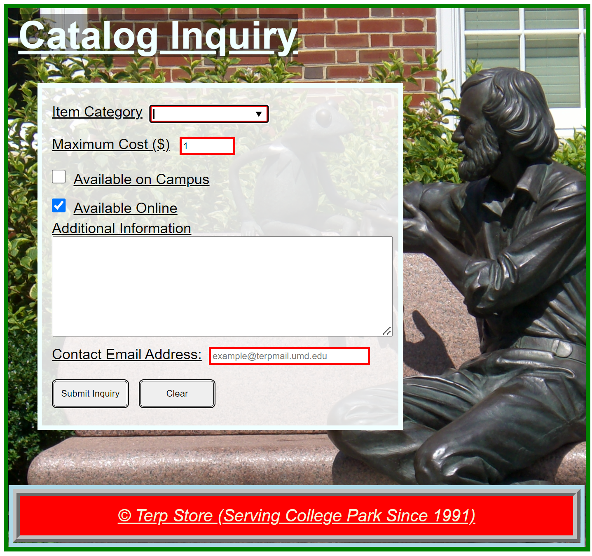
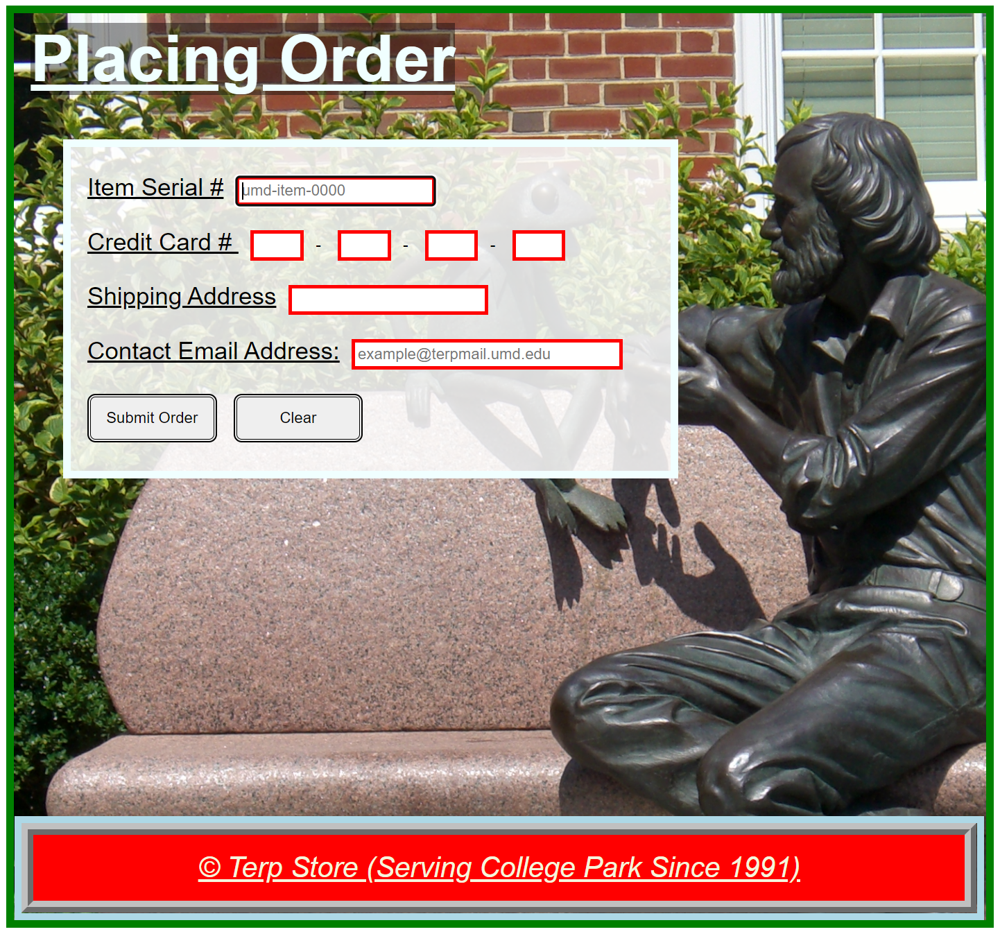

# Project 2: Terp Store

## Due Date: Wednesday, June 26, 2024 11:55 PM EST
## Objectives: Continue practice using docker and ngix, creating web forms and http post/get.

## Overview  
For this project you will implement a system called "Terp Store." The system allows users to inquire about store items and to submit orders. You will define two forms for users to submit data. A video showing some of the system functionality can be found at <a href="https://umd.hosted.panopto.com/Panopto/Pages/Viewer.aspx?id=cd1d6716-acc8-4e81-9c42-ae4400eea998">Application Video</a>.  

## Overview
The project files you will need to complete can all be found inside of the P2 directory. They consist of the following:  
*  __index.shtml__ - This is the main page of the application with links to the catalogInquiry.shtml and the placingOrder.shtml pages. 
*  __catalogInquiry.shtml__ - This page includes a form for users to ask for items' information.  
*  __placingOrder.shtml__ - This page includes a form that allow users to submit an item's order.  
*  __footer.shtml__ - This is a footer that you must include in the other pages using a server side include directive.
*  __style.css__ - All style information will be present in this file. 
*  __processing__ - This folder has the scripts needed for your application. Do no modify these scripts.
*  __images__ - A folder for images.

## Specifications/Requirements

### developing and running the application
We have provided you a nginx.conf file, dockerfile and docker-compose file. To serve up the files you will be doing development in and that will be interacting with the php scripts we have provided. You will need to run `docker-compose up --build` from the root level of the Project2 directory. This will serve up all the files inside of the Pr2 directory at http://localhost:3000  

### index.shtml Page
The __index.shtml__ page represents the application's main page. It will have a link to the __catalogInquiry.shtml__ page and a link to the
__placingOrder.shtml__ page. Define HTML and CSS to recreate the page you see in the image  As long as the page looks close to what you see in the image, you are OK (it does not need to be exact). The requirements for the this page are:  
*	The title (to be used with &lt;title&gt; tag) for the page will be "Terp Store."
*	Implement the CSS in the __style.css__ file. You may use any css units (rem, etc.).
*	Do not add CSS to the HTML file at all (if you do, you will lose credit).
* The page should have a green border and use the JimHenson.jpg image as background.
*	The "Terp Store" header will have an <strong>azure</strong> color and a background color defined by rgba(0, 0, 0, .4).
*	The links to the other two pages will appear in the middle of the page. The first link will be for the catalog inquiry page and the second for the order page. The links will appear in a container with a background color corresponding to rgb(211,211,211, 0.8). The color of the links before they are selected will be <strong>brown</strong>, and <strong>beige</strong> once a link has been visited. When you hover over any of the links, the size of the link should decrease.
* Using the server side include directive #include, include the footer.shtml we provided. <strong>You may not modify this file at all.</strong> Use css to generate the style you see for the footer.
* When a user hovers over the footer link, the size of the link should decrease.

### catalogInquiry.shtml Page  
The <strong>catalogInquiry.shtml</strong> page allow users to submit a store inquiry. Define HTML and CSS to recreate the page you see in the image  As long as the page looks close to what you see in the image, you are OK (it does not need to be exact). The requirements for the this page are:  
*	The title (to be used with &lt;title&gt; tag) for the page will be "Catalog Inquiry."
*	Implement the CSS in the <strong>style.css</strong> file. You can use any css units (rem, etc.).
* Do not add CSS to the HTML file at all (if you do, you will lose credit).
* The page should have a green border and use the JimHenson.jpg image as background.
* The "Catalog Inquiry" header will have an <strong>azure</strong> color and a background color defined by rgba(0, 0, 0, .4).
* Using the server side include directive #include, include the footer.shtml we provided. <strong>You may not modify this file at all.</strong> Use css to generate the style you see for the footer.
* When a user hovers over the footer link, the size of the link should decrease.
* Define a form with the elements specified below.
	*	The form will send data to the <strong>processing/catalogInquiry.php</strong> script using "get".
	*	An element that will allow users to enter a choice or pick one from <strong>clothes, books, music, food, other</strong>. <strong>This field is a required field and it must have the focus.</strong> The name attribute value will be "item-choice".
	*	An element that will allow users to select a number between one (inclusive) and a 1000 (inclusive). The step for this element will be five and the default value one. The name attribute value will be "maximumCost".
	*	A checkbox element that allow us to specify whether an item is available on campus. The name attribute value will be "availableOnCampus".
	*	A checkbox element that allow us to specify whether an item is available online. <strong>This checkbox is checked by default.</strong> The name attribute value will be "availableOnline".
	*	A text area where additional information can be provided. The name attribute value will be "info".
	*	An email field that has "example@terpmail.umd.edu" as placeholder.The name attribute value will be "email".
	*	A <strong>submit</strong> button with the text "Submit Inquiry".
	*	A <strong>reset</strong> button with the text "Clear".
*	The form will be in a container with the background color rgba(255, 255, 255, 0.85) and a border in azure color.

### placingOrder.shtml Page
The <strong>placingOrder.shtml</strong> page allow users to submit an order. Define HTML and CSS to recreate the page you see in the image  As long as the page looks close to what you see in the image, you are OK (it does not need to be exact). The requirements for the this page are:
*	The title (to be used with &lt;title&gt; tag) for the page will be "Placing Order."
*	Implement the CSS in the <strong>style.css</strong> file. You can use any css units (rem, etc.).
*	Do not add CSS to the HTML file at all (if you do, you will lose credit).
*	The page should have a green border and use the JimHenson.jpg page as background.
*	The "Placing Order" header will have an <strong>azure</strong> color and a background color defined by rgba(0, 0, 0, .4).
*	Using the server side include directive #include, include the footer.shtml we provided. <strong>You may not modify this file at all.</strong> Use css to generate the style you see for the footer.
*	When a user hovers over the footer link, the size of the link should decrease.
*	Define a form with the elements specified below:
	*	The form will send data to the local script <strong>processing/placingOrder.php</strong> script using "post".
	*	An element that will allow users to enter an item's serial number.<strong>This field is a required field and it must have the focus.</strong>The field will have a placeholder value of "umd-item-0000".
  The name attribute value will be "serialNumber".
	*	Four elements that will allow users to enter a credit card number.
  Each field will allow a maximum of 4 characters to be entered. Each field is required. The name attribute for each element wil be cc1, cc2, cc3, cc4, respectively.
	* An element that will allow users to enter an address. This field is required and has a maximum length of 80 characters. The name attribute value will be "shipping".
	*	An email field that has "example@terpmail.umd.edu" as placeholder.
  The name attribute value will be "email".
	*	A <strong>submit</strong> button with the text "Submit Order".
	*	A <strong>reset</strong> button with the text "Clear".
*	The form will be in a container with the background color rgba(255, 255, 255, 0.85) and a border in azure color.

### Other Specifications
*	You may not use any authoring tool (e.g., Dreamweaver, etc.)
that generates the HTML/CSS/JavaScript code for you.
*	You may not use Bootstrap, jQuery, React, or any other type of library/framework.
*	You must implement this project by yourself.
*	Make sure you view your code using Chrome (that is the browser we will use to grade your project).
*	You can use any HTML/CSS code we have provided in lecture examples.
*	You will lose credit if your HTML does not validate according to the
[HTML Validator](https://validator.w3.org/)
*	You do not need to validate your CSS although it is recommended.

### Submission 
You will need to commit your changes and push them to your repository on the University Gitlab server. __After you push your changes you should verify that you see your code in your repo in the cloud.__  

__Carefully Read - As we don't have automatic testing performed by the submit server, we will only grade the last submission you provide. If you provide both an on time and a late submission, we will only grade the last submission and apply a 12 pts penalty to it.__
